<div align="center">
  
  <h1>🌸 MindBloom AI</h1>
  <h3>Your Empathetic Voice Companion for Mental Wellness</h3>

  <p>
    <a href="LICENSE">
      
    </a>
    <a href="https://www.python.org/">
      
    </a>
    <a href="https://fastapi.tiangolo.com/">
      
    </a>
    <a href="https://www.twilio.com/">
      
    </a>
  </p>
  
  <p>
    <i>"Every conversation is a chance to make someone feel heard, valued, and a little less alone."</i>
  </p>
</div>

---

> [!NOTE] > **Project Status & Disclaimer**
> This project was developed as a proof-of-concept to demonstrate capabilities in building real-time voice calling agents. As a prototype, it requires further optimization, particularly regarding latency. These improvements are currently in progress.

## 📖 About

**MindBloom AI** (featuring **Artika**) is an AI-powered mental health support companion that provides empathetic, real-time voice conversations. It is designed to be a non-judgmental space where users can express their feelings, practice grounding exercises, and receive immediate support in times of crisis.

## ✨ Key Features

| Feature                     | Description                                                                                  |
| :-------------------------- | :------------------------------------------------------------------------------------------- |
| **🗣️ Multilingual Support** | Converses fluently in **11 Indian languages** including Hindi, Tamil, Bengali, and Marathi.  |
| **❤️ Crisis Detection**     | Intelligently detects signs of distress and triggers immediate **emergency email alerts**.   |
| **🧘 Guided Breathing**     | recognizes requests for calm and leads users through audio-guided **breathing exercises**.   |
| **📊 Mood Analysis**        | Tracks conversation sentiment to adapt responses and provide **post-session summaries**.     |
| **⚡ Low Latency**          | Optimized pipeline delivering voice responses in **under 1.5 seconds**.                      |
| **📅 Easy Scheduling**      | Seamlessly integrates with Google Forms to **book therapy appointments** via voice commands. |

## 🏗️ Architecture

MindBloom orchestrates a low-latency pipeline connecting telephony, speech AI, and LLMs.

```mermaid
flowchart TB
    subgraph User Interaction
        Phone["📱 Telephony"]
    end

    subgraph "Core Infrastructure"
        Twilio["☁️ Twilio Voice\n(WebSocket Stream)"]
        FastAPI["⚡ MindBloom Server\n(FastAPI)"]
    end

    subgraph "AI Services Pipeline"
        Sarvam["🗣️ Sarvam AI\n(STT & TTS)"]
        Groq["🧠 Groq LPU\n(Llama 3.3 70B)"]
    end

    subgraph "External Integrations"
        Gmail["� SMTP Service\n(Alerts & Summaries)"]
    end

    Phone <--> Twilio
    Twilio <--> FastAPI
    FastAPI <--> Sarvam
    FastAPI <--> Groq
    FastAPI --> Gmail

    style FastAPI fill:#e1f5fe,stroke:#01579b
    style Groq fill:#f3e5f5,stroke:#4a148c
    style Sarvam fill:#e8f5e9,stroke:#1b5e20
```



## 🛠️ Technology Stack

| Category         | Technology                                                                                              | Usage                                                                        |
| :--------------- | :------------------------------------------------------------------------------------------------------ | :--------------------------------------------------------------------------- |
| **Backend**      |  | Core application server and WebSocket handler.                               |
| **Telephony**    |     | Handling incoming voice calls and media streams.                             |
| **Speech AI**    | **Sarvam AI**                                                                                           | High-fidelity Speech-to-Text and Text-to-Speech for Indian languages.        |
| **Intelligence** | **Groq LPU**                                                                                            | Extremely fast inference using **Llama 3.3 70B** for real-time conversation. |
| **Tools**        | **uv**                                                                                                  | Fast Python package management.                                              |

## 🚀 Quick Start

### Prerequisites

- Python 3.11+
- [uv](https://astral.sh/uv) package manager
- [ngrok](https://ngrok.com/) (for local tunneling)

### 1. Installation

```bash
# Clone the repository
git clone https://github.com/yourusername/MindBloomAI.git
cd MindBloomAI

# Install dependencies
uv venv
uv sync
```

### 2. Configuration

Create a `.env` file in the root directory:

```env
# AI Providers
GROQ_API_KEY=your_groq_api_key
SARVAM_API_KEY=your_sarvam_api_key

# Telephony
TWILIO_ACCOUNT_SID=your_sid
TWILIO_AUTH_TOKEN=your_token
TWILIO_PHONE_NUMBER=your_twilio_number

# Notifications
SMTP_EMAIL=your_email@gmail.com
SMTP_PASSWORD=your_app_app_password
EMERGENCY_CONTACT_EMAIL=emergency_contact@email.com

# Integrations
GOOGLE_FORM_LINK=https://forms.gle/your-form-id
```

### 3. Running the Application

```bash
# Start the server
uv run python -m app.main
```

### 4. Exposing to Internet

In a new terminal window:

```bash
ngrok http 8000
```

_Copy the forwarding URL (e.g., `https://xxxx.ngrok-free.app`) and configure it in your Twilio Phone Number settings as the Voice Webhook._

## � Voice Commands

Try these phrases during your call:

- **"I'm feeling very anxious."** → _Triggers calming response_
- **"Help me breathe."** → _Starts breathing exercise_
- **"I want to book an appointment."** → _Sends booking link_
- **"I don't think I can go on."** → _Triggers crisis protocol_

## 📄 License

Distributed under the MIT License. See `LICENSE` for more information.

---

<div align="center">
  <p>Built with 💚 for mental wellness.</p>
</div>
