# 🌸 MindBloom AI - Mental Wellness Voice Companion

**Artika** is an AI-powered mental health support companion that provides empathetic, real-time voice conversations in multiple Indian languages. Built with compassion and care.

> _"Every conversation is a chance to make someone feel heard, valued, and a little less alone."_

## 🏗️ Architecture

```mermaid
flowchart TB
    subgraph User["👤 User"]
        Phone["📱 Phone Call"]
    end

    subgraph Twilio["☁️ Twilio"]
        TwilioVoice["Voice API"]
        MediaStream["WebSocket Stream"]
    end

    subgraph MindBloom["🌸 MindBloom AI Server"]
        FastAPI["⚡ FastAPI"]
        CallHandler["📞 Call Handler"]

        subgraph Detection["🔍 Detection Engine"]
            Crisis["🚨 Crisis Detection"]
            Mood["😊 Mood Detection"]
            Breathing["🧘 Breathing Trigger"]
            Booking["📅 Booking Trigger"]
        end

        subgraph Services["🔧 Services"]
            SarvamSTT["🎤 Speech-to-Text"]
            SarvamTTS["🔊 Text-to-Speech"]
            GroqLLM["🧠 Artika AI"]
            EmailSvc["📧 Email Service"]
        end
    end

    subgraph External["🌐 External APIs"]
        Sarvam["Sarvam AI"]
        Groq["Groq API"]
        Gmail["Gmail SMTP"]
    end

    subgraph Outputs["📤 Outputs"]
        CrisisEmail["🚨 Crisis Alert Email"]
        SummaryEmail["📋 Session Summary"]
        BookingEmail["📅 Booking Link"]
    end

    Phone --> TwilioVoice
    TwilioVoice <--> MediaStream
    MediaStream <--> FastAPI
    FastAPI --> CallHandler
    CallHandler --> Detection
    Detection --> Services
    SarvamSTT --> Sarvam
    SarvamTTS --> Sarvam
    GroqLLM --> Groq
    EmailSvc --> Gmail
    Crisis --> CrisisEmail
    CallHandler --> SummaryEmail
    Booking --> BookingEmail
```



## ✨ Features

### 🧠 Mental Health Support

- Warm, empathetic conversational AI (Artika)
- Mood detection and adaptive responses
- Guided breathing exercises with audio
- Crisis detection with emergency alerts

### 📞 Voice Capabilities

- Real-time speech-to-text and text-to-speech
- Support for 11 Indian languages
- Automatic language detection
- WebSocket-based media streaming

### 📧 Smart Features

- **Crisis Detection**: Sends emergency email alerts when distress is detected
- **Session Summaries**: Email follow-up with topics discussed and resources
- **Appointment Booking**: Therapy session booking via Google Forms
- **Conversation Memory**: Remembers context throughout the call

## 🛠️ Tech Stack

| Technology     | Purpose                         |
| -------------- | ------------------------------- |
| **FastAPI**    | High-performance web framework  |
| **Twilio**     | Phone call handling             |
| **Sarvam AI**  | Speech-to-text & text-to-speech |
| **Groq**       | LLM responses (Llama 3.3 70B)   |
| **Gmail SMTP** | Email notifications             |

## 📁 Project Structure

```
mindbloom-ai/
├── app/
│   ├── api/
│   │   └── call_handler.py      # Call handling & feature logic
│   ├── services/
│   │   ├── sarvam_service.py    # Sarvam AI & Groq integration
│   │   ├── twilio_service.py    # Twilio integration
│   │   └── email_service.py     # Email notifications
│   └── main.py                  # FastAPI entry point
├── assets/
│   └── Inhale.mp3               # Breathing exercise audio
├── recordings/                   # Saved audio files (gitignored)
├── .env                          # Environment variables
└── README.md
```

## 🚀 Quick Start

### 1. Install Dependencies

```bash
# Install uv (if not installed)
irm https://astral.sh/uv/install.ps1 | iex  # Windows
curl -LsSf https://astral.sh/uv/install.sh | sh  # macOS/Linux

# Setup project
uv venv
uv sync
```

### 2. Configure Environment

Create `.env` file:

```env
# Groq API (https://console.groq.com)
GROQ_API_KEY=your_groq_api_key

# Sarvam AI (https://sarvam.ai)
SARVAM_API_KEY=your_sarvam_api_key

# Twilio (https://twilio.com)
TWILIO_ACCOUNT_SID=your_sid
TWILIO_AUTH_TOKEN=your_token
TWILIO_PHONE_NUMBER=+1234567890

# Email (Gmail with App Password)
SMTP_EMAIL=your_email@gmail.com
SMTP_PASSWORD=your_app_password

# Emergency Contact
EMERGENCY_CONTACT_EMAIL=emergency@email.com

# Appointment Booking
GOOGLE_FORM_LINK=https://forms.gle/your-form
```

### 3. Run the Server

```bash
# Start server
uv run python -m app.main

# In another terminal, start ngrok
ngrok http 8000
```

### 4. Configure Twilio

1. Go to Twilio Console → Phone Numbers
2. Set Voice Webhook URL: `https://your-ngrok-url/incoming-call`
3. Method: POST

## 🎯 Feature Triggers

| Feature                   | Trigger Phrases                                 |
| ------------------------- | ----------------------------------------------- |
| 🧘 **Breathing Exercise** | "Help me breathe", "Calm me down", "Meditation" |
| 📅 **Book Appointment**   | "Book appointment", "Talk to therapist"         |
| 🚨 **Crisis Alert**       | "I want to die", "Giving up", "Hopeless"        |
| 👋 **End Call**           | "Goodbye", "Bye", "Thank you"                   |

## 🌍 Supported Languages

Hindi, Bengali, Kannada, Malayalam, Marathi, Odia, Punjabi, Tamil, Telugu, Gujarati, English

## 🚨 Crisis Detection

When crisis keywords are detected, the system:

1. ✉️ Sends immediate email to emergency contact
2. 🗣️ Provides compassionate response with helpline numbers
3. 📝 Logs the incident for follow-up

**Helplines included:**

- iCALL: 9152987821
- Vandrevala Foundation: 1860-2662-345

## 📧 Email Features

- **Crisis Alerts**: Immediate notification with caller details
- **Session Summaries**: Topics discussed + self-care resources
- **Appointment Links**: Google Form booking links

## 🔧 Troubleshooting

| Issue                 | Solution                    |
| --------------------- | --------------------------- |
| WebSocket disconnects | Check ngrok is running      |
| No audio response     | Verify Sarvam API key       |
| Emails not sending    | Check Gmail App Password    |
| Crisis not detected   | Check exact phrase matching |

## 📄 License

MIT License - Built with 💚 for mental wellness

---

**MindBloom AI** - _Your gentle guide on your mental wellness journey_ 🌸
