<div align="center">
  
  <h1>🌸 MindBloom AI</h1>
  <h3>Your Empathetic Voice Companion for Mental Wellness</h3>

  <p>
    <a href="LICENSE">
      
    </a>
    <a href="https://www.python.org/">
      
    </a>
    <a href="https://fastapi.tiangolo.com/">
      
    </a>
    <a href="https://www.twilio.com/">
      
    </a>
    <a href="https://www.docker.com/">
      
    </a>
  </p>
  
  <p>
    <i>"Every conversation is a chance to make someone feel heard, valued, and a little less alone."</i>
  </p>
</div>

---

> [!NOTE] > **Learning Project & Disclaimer**  
> This project was built as a hands-on exploration to deeply understand and test my knowledge of **real-time voice agents**, **bidirectional audio streaming**, and **low-latency AI pipelines**. It demonstrates the integration of telephony systems with modern speech AI and LLMs in a practical, production-oriented context.

---

## 🎯 Why I Built This

I created **MindBloom AI** to bridge the gap between theoretical knowledge and practical implementation of realtime voice agents. The project served as my personal testing ground to:

- **Master WebSocket-based audio streaming** — Understanding bidirectional media streams between Twilio and the application server
- **Implement real-time Speech-to-Text and Text-to-Speech pipelines** — Working with Sarvam AI for multilingual Indian language support
- **Optimize latency in conversational AI** — Achieving sub-1.5 second response times in voice interactions
- **Handle complex state management** — Managing conversation context, sentiment analysis, and crisis detection across streaming audio
- **Integrate multiple AI services** — Orchestrating Groq's LPU inference, Sarvam's speech services, and custom business logic

This isn't just a demo—it's a comprehensive exploration of what goes into building production-grade voice AI systems.

---

## 📖 About

**MindBloom AI** (featuring **Artika**, the AI companion) is an AI-powered mental health support system that provides empathetic, real-time voice conversations. It creates a non-judgmental space where users can express their feelings, practice grounding exercises, and receive immediate support during moments of crisis.

## ✨ Key Features

| Feature                     | Description                                                                                                                                      |
| :-------------------------- | :----------------------------------------------------------------------------------------------------------------------------------------------- |
| **🗣️ Multilingual Support** | Converses fluently in **11 Indian languages**: Hindi, Tamil, Telugu, Kannada, Bengali, Marathi, Gujarati, Odia, Malayalam, Punjabi, and Assamese |
| **❤️ Crisis Detection**     | Intelligently detects signs of distress and triggers immediate **emergency email alerts** with conversation context                              |
| **🧘 Guided Breathing**     | Recognizes requests for calm and leads users through audio-guided **breathing exercises**                                                        |
| **📊 Mood Analysis**        | Tracks conversation sentiment to adapt responses and provide **post-session summaries**                                                          |
| **⚡ Low Latency**          | Optimized pipeline delivering voice responses in **under 1.5 seconds** end-to-end                                                                |
| **📅 Easy Scheduling**      | Seamlessly integrates with Google Forms to **book therapy appointments** via voice commands                                                      |
| **🐳 Docker Ready**         | Fully containerized with production-ready Dockerfile for easy deployment                                                                         |

---

## 🏗️ System Architecture

MindBloom orchestrates a sophisticated low-latency pipeline connecting telephony, speech AI, and large language models. The architecture is designed for minimal latency and maximum reliability.

```mermaid
flowchart TB
    subgraph Client["📱 Client Layer"]
        Phone["User Phone Call"]
    end

    subgraph Telephony["☁️ Telephony Infrastructure"]
        TwilioVoice["Twilio Voice API"]
        TwilioMedia["Twilio Media Streams<br/>(WebSocket)"]
    end

    subgraph Core["🔧 MindBloom Core Server"]
        direction TB
        FastAPI["⚡ FastAPI Application<br/>(Async WebSocket Handler)"]
        SessionMgr["🔄 Session Manager<br/>(Conversation State)"]
        AudioBuf["🎵 Audio Buffer<br/>(μ-law ↔ PCM Conversion)"]
    end

    subgraph Services["🧠 AI Services Layer"]
        direction TB
        subgraph Speech["Speech Processing"]
            STT["🎤 Sarvam STT<br/>(Hindi, Tamil, Telugu +8)"]
            TTS["Sarvam TTS<br/>(Natural Voice Synthesis)"]
        end
        subgraph Intelligence["Intelligence Engine"]
            Groq["🚀 Groq LPU<br/>(Llama 3.3 70B)"]
            Crisis["⚠️ Crisis Detector<br/>(Sentiment Analysis)"]
            Mood["📊 Mood Tracker"]
        end
    end

    subgraph External["📤 External Integrations"]
        SMTP["✉️ SMTP Service<br/>(Gmail)"]
        GForms["📋 Google Forms<br/>(Appointment Booking)"]
    end

    Phone <-->|"PSTN/VoIP"| TwilioVoice
    TwilioVoice <-->|"Media Stream Events"| TwilioMedia
    TwilioMedia <-->|"Bidirectional WebSocket<br/>(μ-law Audio)"| FastAPI

    FastAPI --> SessionMgr
    FastAPI --> AudioBuf
    AudioBuf -->|"PCM Audio"| STT
    STT -->|"Transcribed Text"| Groq
    Groq -->|"Response Text"| Crisis
    Crisis -->|"Analyzed Response"| TTS
    TTS -->|"Synthesized Audio"| AudioBuf

    Groq --> Mood
    Crisis -->|"Emergency Detected"| SMTP
    Mood -->|"Session Summary"| SMTP
    Groq -->|"Booking Intent"| GForms

    style FastAPI fill:#e1f5fe,stroke:#01579b,stroke-width:2px
    style Groq fill:#f3e5f5,stroke:#4a148c,stroke-width:2px
    style STT fill:#e8f5e9,stroke:#1b5e20,stroke-width:2px
    style TTS fill:#e8f5e9,stroke:#1b5e20,stroke-width:2px
    style Crisis fill:#ffebee,stroke:#b71c1c,stroke-width:2px
```



### Data Flow

1. **Incoming Call** → Twilio receives the call and establishes a WebSocket connection
2. **Audio Streaming** → μ-law encoded audio streams bidirectionally between Twilio and FastAPI
3. **Speech Recognition** → PCM audio is sent to Sarvam AI for transcription
4. **LLM Processing** → Transcribed text is processed by Groq's LPU running Llama 3.3 70B
5. **Safety Analysis** → Response is analyzed for crisis indicators and sentiment
6. **Voice Synthesis** → Text response is converted to natural speech via Sarvam TTS
7. **Audio Delivery** → Synthesized audio streams back to the caller

---

## 🛠️ Technology Stack

| Category             | Technology                                                                                                   | Purpose                                                     |
| :------------------- | :----------------------------------------------------------------------------------------------------------- | :---------------------------------------------------------- |
| **Runtime**          |  | Core language with async/await support                      |
| **Framework**        |       | High-performance async web framework with WebSocket support |
| **Telephony**        |  | Cloud telephony for incoming calls and media streams        |
| **Speech AI**        | **Sarvam AI**                                                                                                | Multilingual STT/TTS optimized for Indian languages         |
| **LLM Inference**    | **Groq LPU**                                                                                                 | Ultra-fast inference with Llama 3.3 70B (~50ms latency)     |
| **Containerization** |          | Production-ready containerization                           |
| **Package Manager**  | **uv**                                                                                                       | Fast, reliable Python dependency management                 |
| **Audio Processing** | **FFmpeg**                                                                                                   | Audio format conversion (μ-law ↔ PCM)                       |

### Key Dependencies

```
fastapi>=0.68.0       # Async web framework
uvicorn>=0.15.0       # ASGI server
twilio>=7.0.0         # Twilio SDK
groq>=0.4.0           # Groq API client
aiohttp>=3.8.0        # Async HTTP client
websockets>=10.0      # WebSocket support
httpx>=0.25.0         # Modern HTTP client
```

---

## 🚀 Quick Start

### Prerequisites

- **Python 3.11+** (or Docker)
- **[uv](https://astral.sh/uv)** package manager (recommended) or pip
- **[ngrok](https://ngrok.com/)** for local development tunneling
- Active accounts: **Twilio**, **Groq**, **Sarvam AI**, **Gmail** (for SMTP)

---

### Option 1: 🐳 Docker Deployment (Recommended)

The easiest way to run MindBloom AI is using Docker.

#### Build the Image

```bash
# Clone the repository
git clone https://github.com/HimanshuMohanty-Git24/MindBloomAI.git
cd MindBloomAI

# Build the Docker image
docker build -t mindbloom-ai .
```

#### Run the Container

```bash
# Run with environment file
docker run -d \
  --name mindbloom \
  -p 8000:8000 \
  --env-file .env \
  -v $(pwd)/recordings:/app/recordings \
  mindbloom-ai
```

#### Docker Configuration Details

| Option                                 | Description                                       |
| :------------------------------------- | :------------------------------------------------ |
| `-p 8000:8000`                         | Exposes the FastAPI server on port 8000           |
| `--env-file .env`                      | Loads environment variables from your `.env` file |
| `-v $(pwd)/recordings:/app/recordings` | Persists call recordings to host machine          |

#### View Logs

```bash
docker logs -f mindbloom
```

#### Stop the Container

```bash
docker stop mindbloom && docker rm mindbloom
```

---

### Option 2: Local Development Setup

#### 1. Clone & Install

```bash
# Clone the repository
git clone https://github.com/HimanshuMohanty-Git24/MindBloomAI.git
cd MindBloomAI

# Create virtual environment and install dependencies
uv venv
uv sync

# Or using pip
python -m venv .venv
source .venv/bin/activate  # On Windows: .venv\Scripts\activate
pip install -r requirements.txt
```

#### 2. Configure Environment

Create a `.env` file in the root directory:

```env
# ═══════════════════════════════════════════════════════
# AI PROVIDERS
# ═══════════════════════════════════════════════════════
GROQ_API_KEY=your_groq_api_key            # Get from: https://console.groq.com
SARVAM_API_KEY=your_sarvam_api_key        # Get from: https://sarvam.ai

# ═══════════════════════════════════════════════════════
# TELEPHONY (Twilio)
# ═══════════════════════════════════════════════════════
TWILIO_ACCOUNT_SID=your_account_sid       # From Twilio Console
TWILIO_AUTH_TOKEN=your_auth_token         # From Twilio Console
TWILIO_PHONE_NUMBER=+1234567890           # Your Twilio phone number

# ═══════════════════════════════════════════════════════
# EMAIL NOTIFICATIONS (Gmail SMTP)
# ═══════════════════════════════════════════════════════
SMTP_EMAIL=your_email@gmail.com           # Gmail address
SMTP_PASSWORD=your_app_password           # Gmail App Password (not regular password)
EMERGENCY_CONTACT_EMAIL=contact@email.com # Where to send crisis alerts

# ═══════════════════════════════════════════════════════
# INTEGRATIONS
# ═══════════════════════════════════════════════════════
GOOGLE_FORM_LINK=https://forms.gle/xxx    # Appointment booking form
```

> [!TIP]
> For Gmail SMTP, enable 2FA and create an **App Password** at [Google Account Settings](https://myaccount.google.com/apppasswords).

#### 3. Run the Application

```bash
# Using uv (recommended)
uv run python -m app.main

# Or using activated virtual environment
python -m app.main
```

The server will start at `http://localhost:8000`

#### 4. Expose to Internet

In a new terminal:

```bash
ngrok http 8000
```

Copy the forwarding URL (e.g., `https://xxxx.ngrok-free.app`) and configure it as:

- **Twilio Console** → Phone Numbers → Your Number → Voice Configuration
- **Webhook URL**: `https://xxxx.ngrok-free.app/voice/incoming`
- **Method**: `POST`

---

## 📁 Project Structure

```
MindBloomAI/
├── app/
│   ├── main.py                 # FastAPI application entry point
│   ├── api/
│   │   └── routes.py           # HTTP & WebSocket endpoint definitions
│   ├── services/
│   │   ├── twilio_service.py   # Twilio webhook & media stream handling
│   │   ├── sarvam_service.py   # Speech-to-Text & Text-to-Speech
│   │   ├── intelligence_service.py  # Groq LLM & conversation logic
│   │   └── email_service.py    # Crisis alerts & session summaries
│   ├── utils/
│   │   └── audio_utils.py      # Audio format conversion utilities
│   └── tests/                  # Unit & integration tests
├── recordings/                 # Call recording storage
├── Dockerfile                  # Production container definition
├── requirements.txt            # Python dependencies
├── pyproject.toml             # Project metadata & uv configuration
└── .env.example               # Environment variable template
```

---

## 🎙️ Voice Commands

Try these phrases during your call:

| Phrase                                        | Action                                               |
| :-------------------------------------------- | :--------------------------------------------------- |
| _"I'm feeling very anxious."_                 | Triggers calming, empathetic response                |
| _"Help me breathe."_ / _"Breathing exercise"_ | Starts guided breathing exercise                     |
| _"I want to book an appointment."_            | Initiates therapy booking flow                       |
| _"I don't think I can go on."_                | **Triggers crisis protocol** — sends emergency alert |
| _"Tell me a joke."_                           | Light conversation to improve mood                   |
| _"How are you, Artika?"_                      | Personality response from the AI companion           |

---

## 🔬 Technical Deep Dive

### Latency Optimization

Achieving sub-1.5 second response times required careful optimization:

| Component     | Target Latency | Technique                              |
| :------------ | :------------- | :------------------------------------- |
| **Network**   | <100ms         | Persistent WebSocket connections       |
| **STT**       | <300ms         | Streaming transcription with Sarvam AI |
| **LLM**       | <200ms         | Groq LPU hardware acceleration         |
| **TTS**       | <400ms         | Optimized voice synthesis              |
| **Audio I/O** | <500ms         | Buffered streaming with μ-law encoding |

### Audio Pipeline

```
User Speech → μ-law (8kHz) → PCM (16kHz) → STT → Text
                                                  ↓
Response Audio ← μ-law (8kHz) ← PCM (16kHz) ← TTS ← LLM
```

### Session State Management

Each call session maintains:

- **Conversation history** for contextual responses
- **Sentiment scores** for adaptive behavior
- **Crisis flags** for safety monitoring
- **Language preference** for multilingual switching

---

## 🧪 Testing

```bash
# Run all tests
uv run pytest

# Run with coverage
uv run pytest --cov=app

# Run specific test file
uv run pytest app/tests/test_services.py -v
```

---

## 📄 License

Distributed under the MIT License. See [LICENSE](LICENSE) for more information.

---

<div align="center">
  <p>Built with 💚 for mental wellness.</p>
  <p><sub>A learning project exploring real-time voice AI pipelines</sub></p>
</div>
